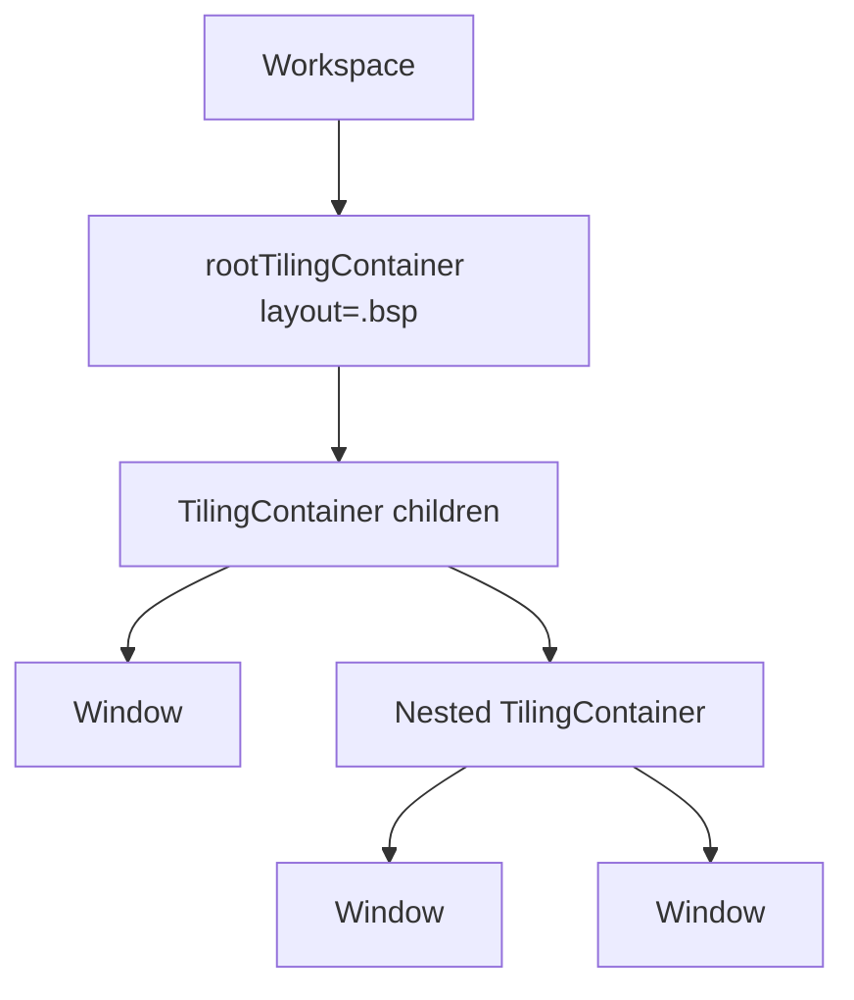
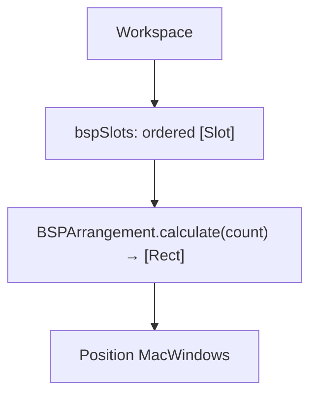

# QUB-32 — BSP komorebi port: design & mapping

**Status:** Signed off (2026-06-02) — pending Linear QUB-32 close  
**Linear:** [QUB-32](https://linear.app/qubeio/issue/QUB-32/bsp-komorebi-port-design-and-mapping)  
**Local references:**

| Repo | Path |
|------|------|
| komorebi-for-mac | `/Users/andreas.frangopoulos/source/repos/komorebi-for-mac` |
| komorebi-layouts (pinned rev `24c0ce0`) | `~/.cargo/git/checkouts/komorebi-af3d9505330cd7a9/24c0ce0/komorebi-layouts` |

---

## 1. Komorebi BSP model

### 1.1 Workspace state (runtime)

A tiling workspace is **not** a nested split tree. It holds:

| Field | Role |
|-------|------|
| `containers: Ring<Container>` | Ordered slots; **one focused container index** at a time |
| `layout` | `Layout::Default(DefaultLayout::BSP)` |
| `layout_options` | `LayoutOptions` — for BSP, `column_ratios[0]` and `row_ratios[0]` (default `0.5`, clamped `0.1…0.9`) |
| `layout_flip` | Optional `Axis` — mirrors primary/secondary split sides in `recursive_fibonacci` |
| `resize_dimensions: Vec<Option<Rect>>` | Per-container resize deltas fed into `calculate` |
| `latest_layout: Vec<Rect>` | Previous frame (scrolling layouts; BSP uses mainly via `calculate`) |

Each `Container` has its own `windows: Ring<Window>` (stacking inside a slot). **v1 AeroSpace port: one window per slot** (see §3).

**Sources:** `komorebi-for-mac/komorebi/src/workspace.rs`, `container.rs`

### 1.2 Window open (new slot)

`new_container_for_window`:

1. If preselect: replace container at preselected index.
2. Else if empty: insert at index `0`.
3. Else: insert **after** `focused_container_idx()` (`idx + 1`).

No MRU tree split, no aspect-ratio heuristic — **slot order alone** defines geometry after the next layout pass.

**Source:** `workspace.rs` ~438–456

### 1.3 Window close (remove slot)

`remove_window` → if container has no windows left → `remove_container_by_idx` (also drops matching `resize_dimensions` entry) → `focus_previous_container`.

**Source:** `workspace.rs` ~619–691

### 1.4 Geometry: `recursive_fibonacci(count, index)`

BSP rectangles are **pure functions** of:

- Monitor/workspace work area (`Rect`)
- `count` = number of containers
- Each container’s **index** `0…count-1`
- `column_split_ratio`, `row_split_ratio` (from `LayoutOptions`)
- `layout_flip`, `resize_dimensions`

Algorithm (simplified):

- `count == 1` → full area
- **Even index** → vertical split: primary column gets `column_split_ratio × width`, recurse in the remainder
- **Odd index** → horizontal split: primary row gets `row_split_ratio × height`, recurse in the remainder

Parity of `idx` alternates split axis down the fibonacci recursion — same tree shape for a given `count`, independent of insertion history.

**Sources:**

- `komorebi-layouts/src/arrangement.rs` — `recursive_fibonacci`, `DefaultLayout::BSP` branch in `calculate`
- Golden tests: `komorebi-layouts/src/arrangement_tests.rs` — `mod bsp_layout_tests` (N = 1…7)

### 1.5 Focus navigation (container index)

BSP uses **index parity**, not spatial tree walks (`komorebi-layouts/src/direction.rs`):

| Direction | Valid when | Target index |
|-----------|------------|----------------|
| Left | `idx != 0` | even: `idx - 2`, odd: `idx - 1` |
| Right | even `idx`, not last | `idx + 1` |
| Up | not 0 or 1 | even: `idx - 1`, odd: `idx - 2` |
| Down | odd `idx`, not last | `idx + 1` |

`window_manager::focus_container_in_direction` → `workspace.new_idx_for_direction` → layout’s `Direction` trait.

### 1.6 Resize (BSP)

- User resize updates `resize_dimensions[i]` as edge deltas (`Rect` left/top/right/bottom).
- `enforce_resize_constraints_for_bsp`: even indices cannot grow `bottom`; odd cannot grow `right`; slot 0 cannot grow left/top.

**Source:** `workspace.rs` ~1659+

### 1.7 Apply layout

`Workspace::update` (tiled path):

```text
layouts = layout.as_boxed_arrangement().calculate(area, container_count, …)
for (i, container) in containers.enumerate():
    position each window in container to layouts[i]
```

No recursive walk of nested splits.

**Source:** `workspace.rs` ~1375–1435

---

## 2. AeroSpace today vs target

### 2.1 Today (tree BSP)



| Concern | Current implementation |
|---------|------------------------|
| Structure | Nested `TilingContainer` under `rootTilingContainer` |
| Open window | Split **MRU** window’s parent; create nested container (`MacWindow.swift` ~229–245) |
| Split axis (2 windows) | Forced **vertical** root split |
| Split axis (3+) | `preferredSplitDirection` → aspect ratio vs `autoSplitThreshold` → alternate parent orientation |
| Geometry | `layoutBSP` walks tree; weights on children (`layoutRecursive.swift`) |
| Normalization | `normalizeBSPTwoWindows`, `flattenSingleChildBSPContainers` (`normalizeContainers.swift`) |
| Focus / swap / join-with | `closestParent(hasChildrenInDirection:)` tree walk |
| Resize | Adjust `adaptiveWeight` on tree edges (`ResizeCommand`, same as tiles) |
| Config `[bsp]` | `split-ratio`, `auto-split-threshold`, `preferred-split-direction` |

Tree order **can** diverge from komorebi slot order for the same window count → different rectangles.

### 2.2 Target (komorebi-aligned)



| Concern | Target |
|---------|--------|
| Structure | Flat slot list on `Workspace` (v1: 1 window ↔ 1 slot) |
| Open window | Insert slot after focused index (komorebi semantics) |
| Close window | Remove slot; renumber; recalculate |
| Geometry | Swift port of `recursive_fibonacci` + golden tests from `bsp_layout_tests` |
| Normalization | **None** for BSP slot count / two-window hacks |
| Focus / swap | Container-index rules from `direction.rs` (BSP branch) |
| Resize | Per-slot `resize_dimensions` into `calculate` |
| Root container | Tiles/accordion unchanged; BSP workspaces skip `layoutRecursive` for tiling windows |

**Persistence:** Serialize slot order + per-slot resize state; on load, rebuild rects from `calculate` (not nested `layoutDescription`).

---

## 3. v1 scope

| In scope | Out of scope (defer) |
|----------|----------------------|
| One tiled window per BSP slot | Multiple windows per container (komorebi stacking) |
| `DefaultLayout::BSP` geometry only | Columns/Grid/Scrolling layouts |
| Port `recursive_fibonacci` + `bsp_layout_tests` | Rust dependency at runtime |
| Focus left/right/up/down via index rules | DFS focus order matching old tree |
| `resize` / mouse resize via slot deltas | Full `layout_options_rules` thresholds |
| `layout bsp` migration from tree → slots | Komorebi monocle/maximize/floating parity |
| Move window between workspaces with slot model | |

---

## 4. Product rules

### 4.1 Split ratios & flip

| AeroSpace today | Komorebi / target |
|-----------------|-------------------|
| `[bsp] split-ratio` (single `Double`, default `0.5`) | Map to **both** primary splits: `column_ratios[0]` and `row_ratios[0]` unless we add separate keys in QUB-41 |
| `preferred-split-direction`, `auto-split-threshold` | **Dropped for BSP** — open direction no longer chooses tree axis; geometry follows slot index only |
| (none) | `layout_flip` — add `[bsp] layout-flip` in QUB-41 if we want komorebi parity |

### 4.2 Two-window rule

**Today:** `normalizeBSPTwoWindows` forces root **vertical** split regardless of insertion path.

**Target:** With exactly **2 slots**, `recursive_fibonacci` yields:

- Index 0: left column (width ≈ `column_ratio × W`)
- Index 1: right column, full height

That is a **horizontal** partition (side-by-side), not top/bottom — **unless** we add an AeroSpace-specific post-pass for `count == 2` (diverges from komorebi golden tests).

**Decision (signed off 2026-06-02):**

- [x] **A — Match komorebi:** 2 windows = side-by-side (drop `normalizeBSPTwoWindows` and the forced vertical split in `MacWindow` for `count == 1`).
- [ ] ~~B — Keep AeroSpace vertical two-window UX~~ — rejected.

Golden tests from `bsp_layout_tests` are authoritative for N = 2.

### 4.3 Commands on BSP workspaces

| Command | v1 proposal |
|---------|-------------|
| `focus (left\|right\|up\|down)` | Slot index rules (§1.5) |
| `swap` | Swap two slot indices (komorebi `swap_containers`) |
| `join-with` | **Unsupported** — err or no-op; no tree siblings |
| `split` | **Unsupported** (already awkward with flatten normalization) |
| `move …` | Reparent window; target BSP workspace converts to slot list (QUB-39) |
| `layout bsp` | Walk leaf windows in MRU/focus order → build slot list → drop nested BSP tree |
| `balance-sizes` | Reset slot resize deltas / ratios per komorebi “reset resize” behaviour (define in QUB-38) |

### 4.4 Tiles & accordion

Unchanged: still use `TilingContainer` tree + `layoutTiles` / `layoutAccordion`. BSP is a separate workspace mode keyed off `rootTilingContainer.layout == .bsp` until tree BSP is retired (QUB-40).

---

## 5. Code: retire vs keep

### 5.1 Retire after port (QUB-40)

| Area | Files / symbols |
|------|-----------------|
| BSP tree insertion | `MacWindow.swift` — `unbindAndGetBindingDataForNewTilingWindow` BSP branch, `bspSplitOrientation` |
| BSP layout walk | `layoutRecursive.swift` — `layoutBSP` |
| BSP normalization | `normalizeContainers.swift` — `normalizeBSPTwoWindows`, `flattenSingleChildBSPContainers`, BSP branches in `unbindEmptyAndAutoFlatten` |
| Tree-based BSP tests | Assertions on `layoutDescription` nested `.h_tiles` / `.v_tiles` for BSP |

### 5.2 Keep / adapt

| Area | Notes |
|------|-------|
| `Layout.bsp`, `layout bsp` command | Stays; implementation becomes slot migration |
| `[bsp]` config | QUB-41 alignment |
| `ResizeCommand` / mouse resize | BSP path → slot deltas |
| `FocusCommand` / `SwapCommand` | BSP branch → index rules |
| `FrozenContainer` / closed-window cache | Extend for slot indices (QUB-34) |
| Tiles, accordion, floating, dialogs | No change |

### 5.3 Add (implementation issues)

| Linear | Deliverable |
|--------|-------------|
| [QUB-33](https://linear.app/qubeio/issue/QUB-33) | `Sources/AppBundle/layout/komorebi/` — `BSPArrangement.calculate`, golden tests |
| [QUB-34](https://linear.app/qubeio/issue/QUB-34) | `Workspace` slot list, bind/unbind |
| [QUB-35](https://linear.app/qubeio/issue/QUB-35) | Refresh path: calculate → set frames |
| [QUB-36](https://linear.app/qubeio/issue/QUB-36) | Open/close → insert/remove slot |
| [QUB-37](https://linear.app/qubeio/issue/QUB-37) | Focus & swap |
| [QUB-38](https://linear.app/qubeio/issue/QUB-38) | Resize |
| [QUB-39](https://linear.app/qubeio/issue/QUB-39) | Move & workspace commands |
| [QUB-40](https://linear.app/qubeio/issue/QUB-40) | Delete tree BSP |
| [QUB-41](https://linear.app/qubeio/issue/QUB-41) | Config |
| [QUB-42](https://linear.app/qubeio/issue/QUB-42) | Integration tests |
| [QUB-43](https://linear.app/qubeio/issue/QUB-43) | User docs & migration |

---

## 6. Index ↔ geometry cheat sheet (N = 4)

Komorebi BSP with default ratios (see `bsp_layout_tests`):

```text
+-------+-----+
|   0   |  1  |
|       +--+--+
|       |2 |3 |
+-------+--+--+
```

Slot order follows insertion/focus order, not tree depth-first order.

---

## 7. Sign-off (QUB-32 gate)

Before starting [QUB-33](https://linear.app/qubeio/issue/QUB-33):

- [x] Komorebi model (§1) accurately described
- [x] Today vs target (§2) agreed
- [x] v1 scope (§3) agreed
- [x] Two-window rule: **A — match komorebi** (§4.2, Andreas 2026-06-02)
- [x] Command behaviour table (§4.3) agreed (default v1 proposals in doc)
- [x] Retire/keep list (§5) agreed

**Signed off by:** Andreas **Date:** 2026-06-02

---

## Appendix: verification commands

```bash
# Golden tests (upstream)
cd /Users/andreas.frangopoulos/source/repos/komorebi-for-mac
cargo test -p komorebi-layouts bsp_layout_tests

# AeroSpace (after QUB-33+)
cd /Users/andreas.frangopoulos/source/repos/qubeio/AeroSpace
./run-swift-test.sh --filter BSPLayout
make test
```
